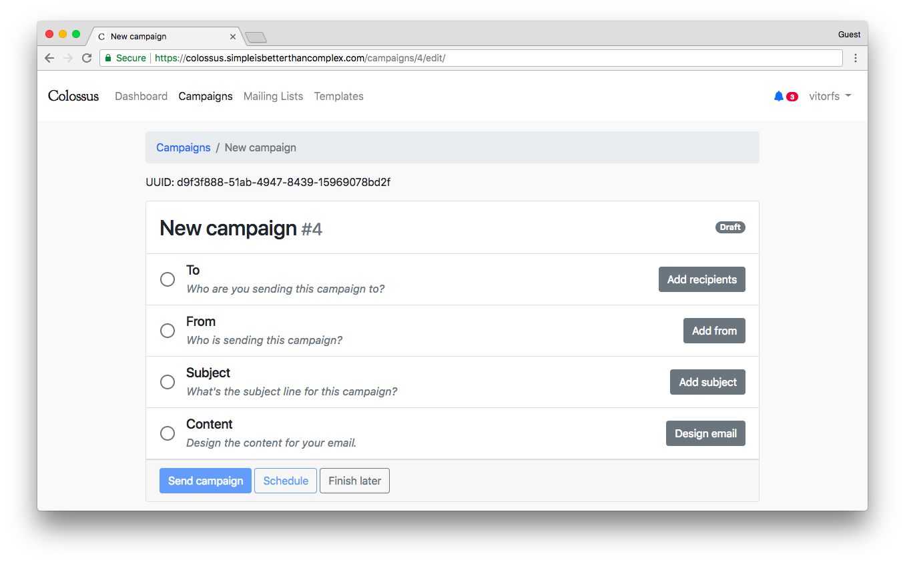
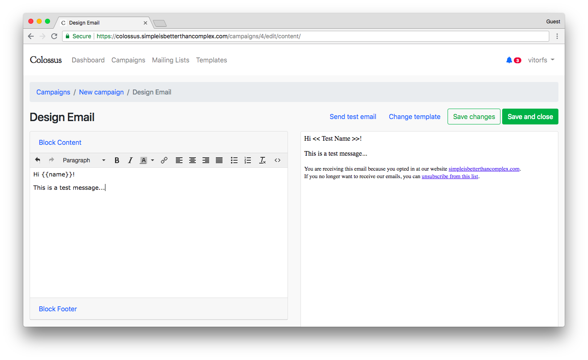
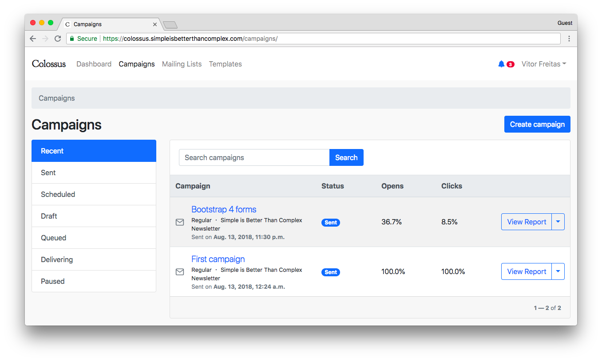
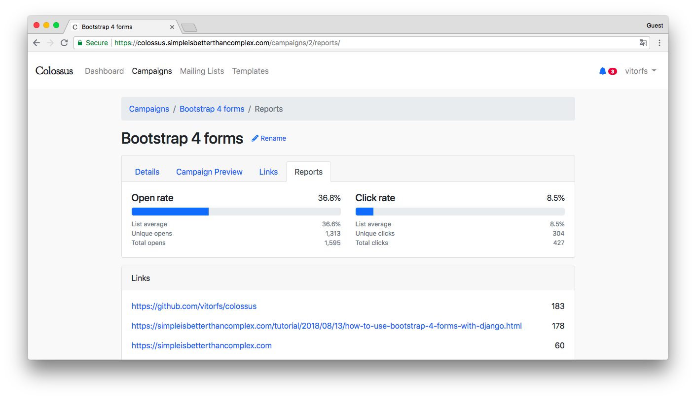
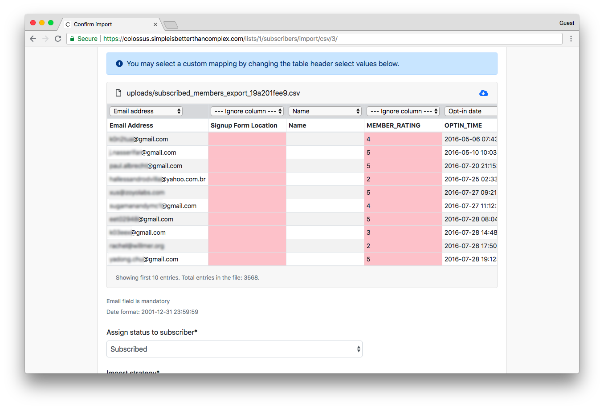
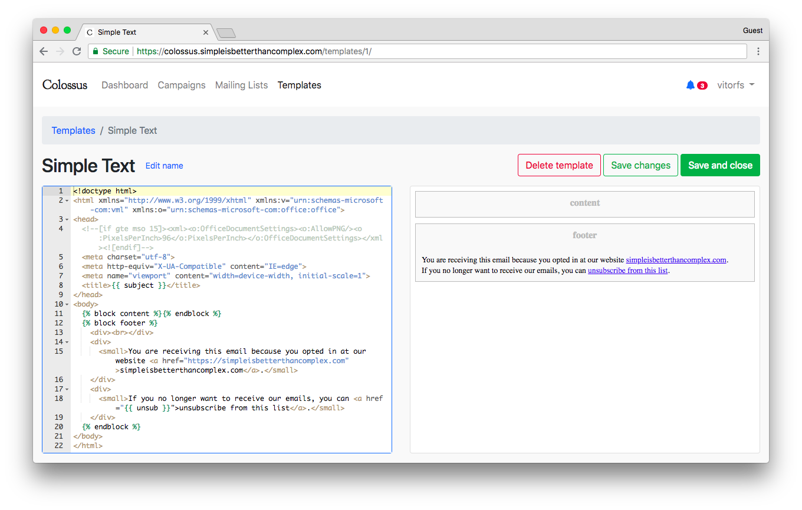

Features
========

In this page you will find an overview of features available on Colossus and a few screenshots of some of its features.

Overview
--------

* Create and manage multiple mailing lists;
* Import lists from other providers (csv files or paste email addresses);
* Create reusable email templates;
* Customize sign up pages (subscribe, unsubscribe, thank you page, etc.);
* Default double opt-in for sign ups;
* Schedule email campaign to send on a specific date and time;
* Track email opens and clicks;
* Change link URL after email is sent;
* Reports with geolocation;
* Compatible with Mailgun, SendGrid, Mandrill, or any other SMTP email service.

Screenshots
-----------

Create new campaign page:

Compose emails using a rich text editor:

Campaign listing page. Each campaign is an email you sent to your mailing list:

View reports how your campaign is performing:

Import subscribers from other services like MailChimp or SendGrid. With Colossus you can import emails in any format
by defining to which field each column should be save:

Create customizable email templates to be used in campaigns:

